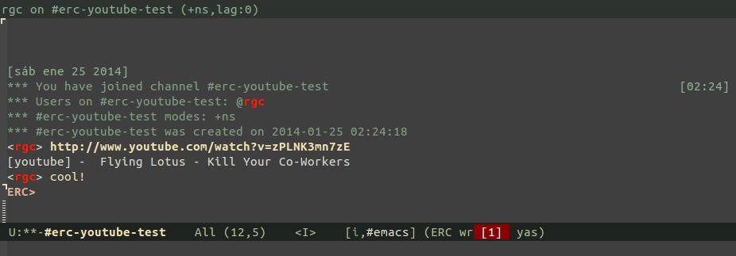

# erc-youtube.el #

Show inlined info about youtube links in erc buffers.

## Usage

```lisp
(require 'erc-youtube)
(add-to-list 'erc-modules 'youtube)
(erc-update-modules)
```

Or `(require 'erc-youtube)` and  `M-x customize-option erc-modules RET`

This plugin subscribes to hooks `erc-insert-modify-hook` and
`erc-send-modify-hook` to download and show images.

## Screenshot



## Author

* [Raimon Grau](https://github.com/kidd)
